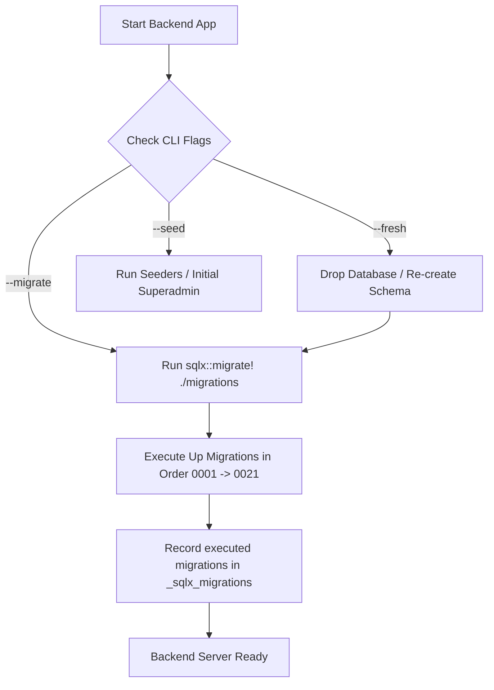

# DDL & Alur Migrasi Database DKA Sigma Digital Signage Enterprise

Dokumen ini memetakan seluruh struktur **Data Definition Language (DDL)**, arsitektur modul **Authentication & IAM (Identity and Access Management)**, relasi antartabel, serta **alur migrasi database** di backend Rust.

---

## 1. Alur & Mekanisme Migrasi Database

Backend menggunakan **SQLx (`sqlx::migrate!`)** untuk manajemen migrasi PostgreSQL secara terotomatisasi dan bertahap.



### CLI Command Flags
Backend Rust (`backend/src/main.rs`) mendukung beberapa argumen baris perintah untuk mengelola migrasi & seeder:
- `cargo run -- --migrate`: Menjalankan semua migrasi yang belum dieksekusi di folder `backend/migrations/`.
- `cargo run -- --fresh`: (Opsional) Mengosongkan skema lalu menjalankan ulang seluruh migrasi dari awal (`0001` - `0021`).
- `cargo run -- --seed`: Memasukkan data awal (permissions default, superadmin user dengan hash Argon2 `superadmin`).

### Lokasi Migration Files
Semua file migrasi disimpan di `backend/migrations/` berformat SQL standar dengan penamaan terurut (`XXXX_name.up.sql` dan `XXXX_name.down.sql`).

---

## 2. Pemetaan DDL Modul Login & IAM

Modul **IAM & Autentikasi** mengelola User, Role, Role Group, dan Permission untuk mendukung **Role-Based Access Control (RBAC)** dan **Group-Based Access Control**.

```mermaid
erdiagram
    users ||--o{ user_roles : "has"
    roles ||--o{ user_roles : "assigned to"
    users ||--o{ user_role_groups : "belongs to"
    roles_groups ||--o{ user_role_groups : "assigned to"
    roles_groups ||--o{ roles_groups_roles : "contains"
    roles ||--o{ roles_groups_roles : "grouped in"
    roles ||--o{ role_permissions : "grants"
    permissions ||--o{ role_permissions : "linked to"
```

### 2.1. Tabel `users`
Tabel utama untuk akun pengguna/operator yang dapat login ke dashboard.

```sql
CREATE TABLE IF NOT EXISTS users (
    id UUID PRIMARY KEY DEFAULT gen_random_uuid(),
    email VARCHAR(255) NOT NULL UNIQUE,
    password_hash VARCHAR(255) NOT NULL,
    full_name VARCHAR(150) NOT NULL,
    is_active BOOLEAN NOT NULL DEFAULT TRUE,
    created_at TIMESTAMPTZ NOT NULL DEFAULT NOW(),
    updated_at TIMESTAMPTZ NOT NULL DEFAULT NOW()
);

CREATE INDEX IF NOT EXISTS idx_users_email ON users(email);
```

- **Mekanisme Autentikasi Login**:
  1. Client mengirim request gRPC `Login(email, password)`.
  2. Backend mencocokkan `email` pada tabel `users`.
  3. Memverifikasi status `is_active = TRUE`.
  4. Verifikasi `password` mentah dengan `password_hash` menggunakan algoritma **Argon2id**.
  5. Jika valid, backend menerbitkan JWT token yang ditandatangani dengan `JWT_SECRET`.

---

### 2.2. Tabel `roles`
Menyimpan definisi peran pengguna (misal: `Superadmin`, `Content Creator`, `Operator`).

```sql
CREATE TABLE IF NOT EXISTS roles (
    id UUID PRIMARY KEY DEFAULT gen_random_uuid(),
    name VARCHAR(100) NOT NULL,
    slug VARCHAR(100) NOT NULL UNIQUE,
    description TEXT,
    is_system BOOLEAN NOT NULL DEFAULT FALSE,
    created_at TIMESTAMPTZ NOT NULL DEFAULT NOW(),
    updated_at TIMESTAMPTZ NOT NULL DEFAULT NOW()
);

CREATE INDEX IF NOT EXISTS idx_roles_slug ON roles(slug);
```

---

### 2.3. Tabel `permissions`
Menyimpan granularitas izin hak akses fitur dalam sistem (misal: `media.create`, `layout.publish`, `device.reboot`).

```sql
CREATE TABLE IF NOT EXISTS permissions (
    id UUID PRIMARY KEY DEFAULT gen_random_uuid(),
    code VARCHAR(100) NOT NULL UNIQUE,
    name VARCHAR(150) NOT NULL,
    description TEXT,
    module VARCHAR(50) NOT NULL,
    created_at TIMESTAMPTZ NOT NULL DEFAULT NOW(),
    updated_at TIMESTAMPTZ NOT NULL DEFAULT NOW()
);

CREATE INDEX IF NOT EXISTS idx_permissions_code ON permissions(code);
CREATE INDEX IF NOT EXISTS idx_permissions_module ON permissions(module);
```

---

### 2.4. Tabel `roles_groups`
Menyimpan grup peran untuk mempermudah manajemen permission berskala besar.

```sql
CREATE TABLE IF NOT EXISTS roles_groups (
    id UUID PRIMARY KEY DEFAULT gen_random_uuid(),
    name VARCHAR(100) NOT NULL,
    slug VARCHAR(100) NOT NULL UNIQUE,
    description TEXT,
    created_at TIMESTAMPTZ NOT NULL DEFAULT NOW(),
    updated_at TIMESTAMPTZ NOT NULL DEFAULT NOW()
);

CREATE INDEX IF NOT EXISTS idx_roles_groups_slug ON roles_groups(slug);
```

---

### 2.5. Tabel Pivot / Relasi RBAC

#### a. `user_roles`
Menghubungkan user secara langsung ke role tertentu.
```sql
CREATE TABLE IF NOT EXISTS user_roles (
    user_id UUID NOT NULL REFERENCES users(id) ON DELETE CASCADE,
    role_id UUID NOT NULL REFERENCES roles(id) ON DELETE CASCADE,
    created_at TIMESTAMPTZ NOT NULL DEFAULT NOW(),
    PRIMARY KEY (user_id, role_id)
);
```

#### b. `user_role_groups`
Menghubungkan user ke grup role.
```sql
CREATE TABLE IF NOT EXISTS user_role_groups (
    user_id UUID NOT NULL REFERENCES users(id) ON DELETE CASCADE,
    role_group_id UUID NOT NULL REFERENCES roles_groups(id) ON DELETE CASCADE,
    created_at TIMESTAMPTZ NOT NULL DEFAULT NOW(),
    PRIMARY KEY (user_id, role_group_id)
);
```

#### c. `roles_groups_roles`
Menghubungkan role ke dalam role group.
```sql
CREATE TABLE IF NOT EXISTS roles_groups_roles (
    role_group_id UUID NOT NULL REFERENCES roles_groups(id) ON DELETE CASCADE,
    role_id UUID NOT NULL REFERENCES roles(id) ON DELETE CASCADE,
    created_at TIMESTAMPTZ NOT NULL DEFAULT NOW(),
    PRIMARY KEY (role_group_id, role_id)
);
```

#### d. `role_permissions`
Menghubungkan izin/permission spesifik ke role.
```sql
CREATE TABLE IF NOT EXISTS role_permissions (
    role_id UUID NOT NULL REFERENCES roles(id) ON DELETE CASCADE,
    permission_id UUID NOT NULL REFERENCES permissions(id) ON DELETE CASCADE,
    created_at TIMESTAMPTZ NOT NULL DEFAULT NOW(),
    PRIMARY KEY (role_id, permission_id)
);
```

---

## 3. Daftar Lengkap Urutan DDL Migrasi Database

Berikut adalah daftar urutan lengkap 21 migrasi database di folder `backend/migrations/`:

| No | File Migrasi | Tabel Yang Dibuat / Diubah | Deskripsi Singkat |
|---|---|---|---|
| **0001** | `0001_create_permissions.up.sql` | `permissions` | Katalog daftar izin sistem |
| **0002** | `0002_create_roles.up.sql` | `roles` | Daftar peran hak akses |
| **0003** | `0003_create_roles_groups.up.sql` | `roles_groups` | Grup perkelompokkan peran |
| **0004** | `0004_create_role_permissions.up.sql` | `role_permissions` | Pivot relasi role -> permission |
| **0005** | `0005_create_roles_groups_roles.up.sql` | `roles_groups_roles` | Pivot relasi role_group -> role |
| **0006** | `0006_create_users.up.sql` | `users` | Akun pengguna backend / dashboard |
| **0007** | `0007_create_user_roles.up.sql` | `user_roles` | Pivot relasi user -> role |
| **0008** | `0008_create_user_role_groups.up.sql` | `user_role_groups` | Pivot relasi user -> role_group |
| **0009** | `0009_create_canary_groups.up.sql` | `canary_groups` | Grup testing & deployment versi staging |
| **0010** | `0010_create_layouts.up.sql` | `layouts` | Desain kanvas & resolusi tayangan |
| **0011** | `0011_create_display_groups.up.sql` | `display_groups` | Pengelompokan perangkat player |
| **0012** | `0012_create_devices.up.sql` | `devices` | Perangkat player signage (Android/Linux) |
| **0013** | `0013_create_media_items.up.sql` | `media_items` | File gambar, video, & web URL |
| **0014** | `0014_create_zones.up.sql` | `zones` | Zona area per-layout |
| **0015** | `0015_create_playlists.up.sql` | `playlists` | Daftar putar item media |
| **0016** | `0016_create_playlist_items.up.sql` | `playlist_items` | Item media di dalam playlist |
| **0017** | `0017_create_zone_blocks.up.sql` | `zone_blocks` | Blok playlist/media yang ditempel di zona |
| **0018** | `0018_create_zone_playlist_item_overrides.up.sql` | `zone_playlist_item_overrides` | Override properti item di dalam blok zona |
| **0019** | `0019_create_device_layouts.up.sql` | `device_layouts` | Penjadwalan layout ke perangkat |
| **0020** | `0020_create_device_telemetry.up.sql` | `device_telemetry` | Log telemetri RAM, Storage, & Status player |
| **0021** | `0021_create_schedules.up.sql` | `schedules`, `schedule_events` | Penjadwalan event tayangan signage |

---

## 4. Alur Verifikasi DDL & Migrasi

Untuk menjalankan dan memastikan migrasi berjalan dengan baik di lingkungan lokal atau server:

1. **Jalankan Migrasi Database**:
   ```bash
   cargo run --bin signage-backend -- --migrate
   ```
2. **Jalankan Seeder Pengguna Default**:
   ```bash
   cargo run --bin signage-backend -- --seed
   ```
3. **Pemeriksaan Status Migrasi via SQLx CLI** (opsional):
   ```bash
   sqlx migrate info --source backend/migrations
   ```
